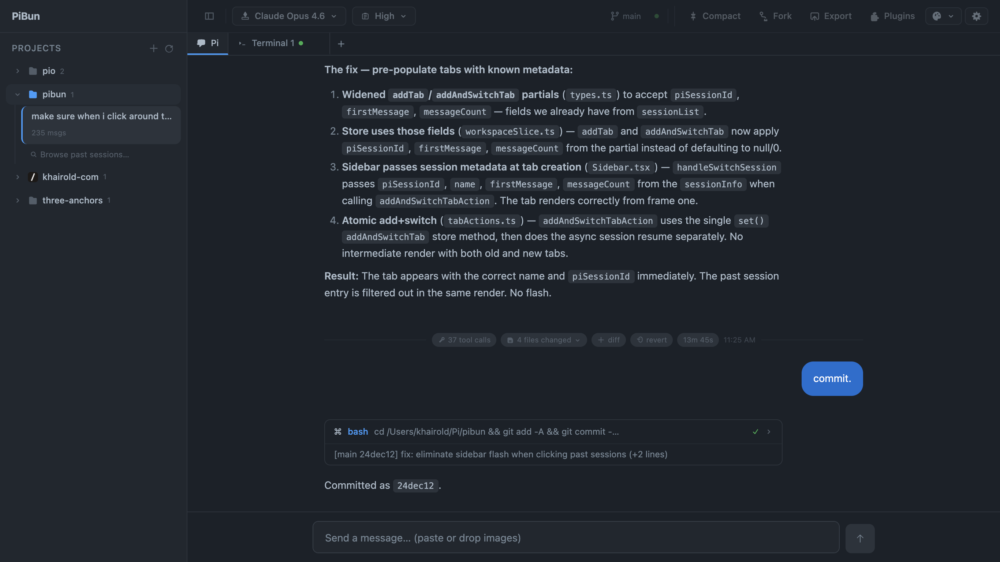

# PiBun

A desktop app for the [Pi coding agent](https://github.com/badlogic/pi-mono). Chat with AI, run tools, manage projects — all in a native window.



## Features

- **Chat with Pi** — streaming responses, thinking blocks, syntax-highlighted code, image paste
- **Tool execution** — watch Pi read files, write code, run commands in real time
- **Projects** — organize work by project, switch between them, browse past sessions
- **Built-in terminal** — full PTY terminal tabs alongside chat, scoped to each project
- **Git integration** — branch, status, changed files, inline diffs with syntax highlighting
- **Session export** — save conversations as HTML, Markdown, or JSON
- **Themes** — 5 built-in themes, follows system dark/light preference
- **Plugins** — sandboxed iframe plugins with a postMessage bridge
- **Model switching** — pick any model Pi supports, adjust thinking level on the fly
- **Native desktop app** — built with [Electrobun](https://electrobun.dev), not Electron. Bun-native, fast, small.

## Download

**[⬇ PiBun v0.1.1 for macOS (Apple Silicon)](https://github.com/khairold/pibun/releases/download/v0.1.1/stable-macos-arm64-PiBun.dmg)** — 20 MB

> **Note:** This build is unsigned. macOS will warn you on first launch. Right-click the app → Open → Open to bypass Gatekeeper. Linux and Windows builds coming soon.

Requires [Pi](https://github.com/badlogic/pi-mono) installed: `npm i -g @mariozechner/pi-coding-agent`

## Prerequisites

- [Bun](https://bun.sh) ≥ 1.2.21
- [Pi](https://github.com/badlogic/pi-mono) installed and on your PATH (`npm i -g @mariozechner/pi-coding-agent`)
- macOS (Linux and Windows support in progress)

## Quick Start

```bash
# Clone
git clone https://github.com/khairold/pibun.git
cd pibun

# Install
bun install
bun pm trust @biomejs/biome && bun pm trust esbuild

# Run in dev mode (3 terminals)
bun run dev:server    # terminal 1 — API server on :24242
bun run dev:web       # terminal 2 — Vite dev server on :5173
cd apps/desktop && PIBUN_DEV=1 npx electrobun dev  # terminal 3 — desktop app
```

Or run without the desktop shell:

```bash
bun run dev:server    # terminal 1
bun run dev:web       # terminal 2
# Open http://localhost:5173 in your browser
```

## Build

```bash
bun run build                    # build all packages
bun run build:desktop            # unsigned desktop app
bun run build:desktop:signed     # signed + notarized macOS build
```

## Architecture

```
┌──────────────┐     WebSocket       ┌──────────────┐     stdio/JSONL     ┌──────────┐
│  React UI    │ ◄──────────────────►│  Bun Server  │ ◄──────────────────►│ pi --rpc │
│  (Vite)      │                     │              │                     │          │
│  Chat, Tools │                     │  Bridge      │                     │ LLM API  │
│  Sessions    │                     │              │                     │ Tools    │
└──────────────┘                     └──────────────┘                     └──────────┘
         ▲                                  ▲
         └──────── Electrobun webview ──────┘
```

The server spawns `pi --mode rpc` as a subprocess and bridges JSONL events over WebSocket to the React frontend. Pi handles all the hard stuff — session persistence, model registry, API keys, tool execution, extensions. PiBun is the visual layer.

| Package | Role |
|---------|------|
| `apps/server` | Bun HTTP + WebSocket server, Pi subprocess manager |
| `apps/web` | React 19 + Vite + Zustand + Tailwind CSS v4 |
| `apps/desktop` | Electrobun native wrapper (menus, file dialogs, notifications) |
| `packages/contracts` | Shared TypeScript types (no runtime code) |
| `packages/shared` | Shared utilities (JSONL parser) |

## Tech Stack

| | |
|---|---|
| Runtime | [Bun](https://bun.sh) |
| Desktop | [Electrobun](https://electrobun.dev) |
| Frontend | React 19, Vite, Zustand, Tailwind CSS v4 |
| Language | TypeScript (strict) |
| Agent | [Pi](https://github.com/badlogic/pi-mono) via RPC subprocess |

## Contributing

Contributions welcome. The codebase is structured for AI agent development (deep modules, few files per domain) — see `CLAUDE.md` for conventions.

```bash
bun run typecheck    # type check all packages
bun run lint         # biome lint
bun run format       # biome format
```

## License

[MIT](LICENSE)
